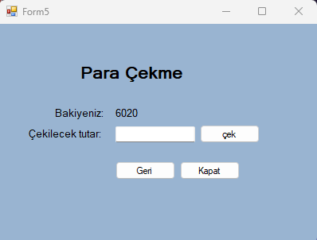
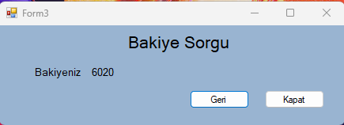

# Atm Otomasyonu

 ### Giriş ekranından girilen müşteri id ve şifreyi veri tabanından kontrol ediyoruz ve geri kalan işlemleri de giriş yapan kişi adına yapıyoruz.

* Kullanıcı No: **1001**
* Şifre: **1234**
### Giriş yaptıktan sonra gelen formdan yapılabilecek işlemleri görüntülüyoruz.

### Para Çekme bölümünden kalan bakiyeyi görebiliyor ve istediğimiz tutarı çekebiliyoruz.

### Para yatırma bölümünde de aynı şekilde bakiyeyi görebiliyor ve yatırabiliyoruz.

### Ayrıca Bakiye sorgulama bölümümüz de var

### Seçilen faturaya göre ödemleri yapabileceğimiz bir panel de bulunuyor. 

## 🔏 Lisans

**The** [**MIT License**](https://choosealicense.com/licenses/apache-2.0/) **©️ Ahmet Utan**